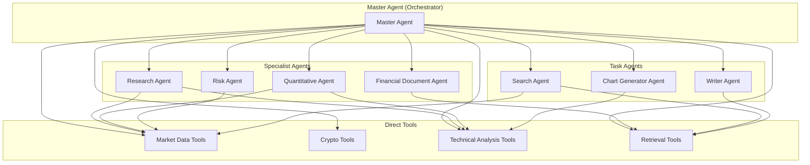
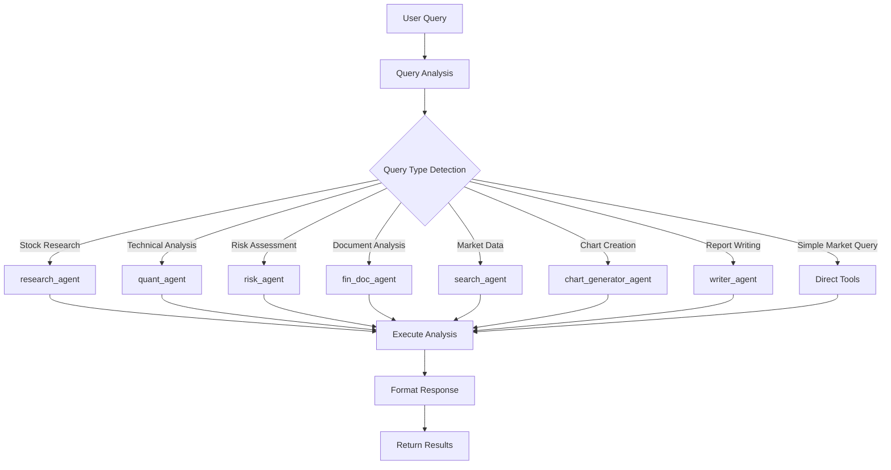
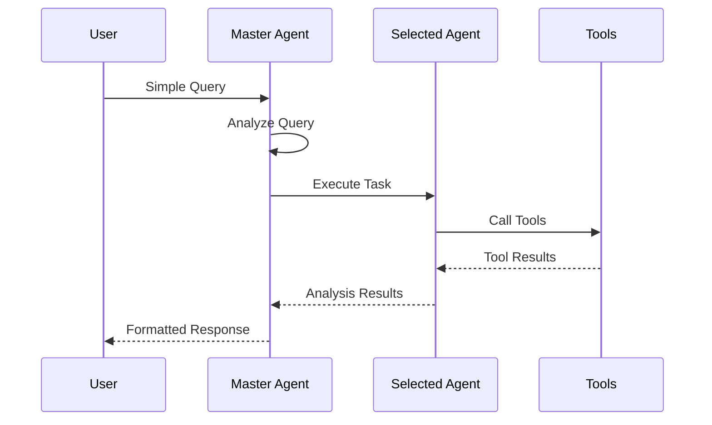
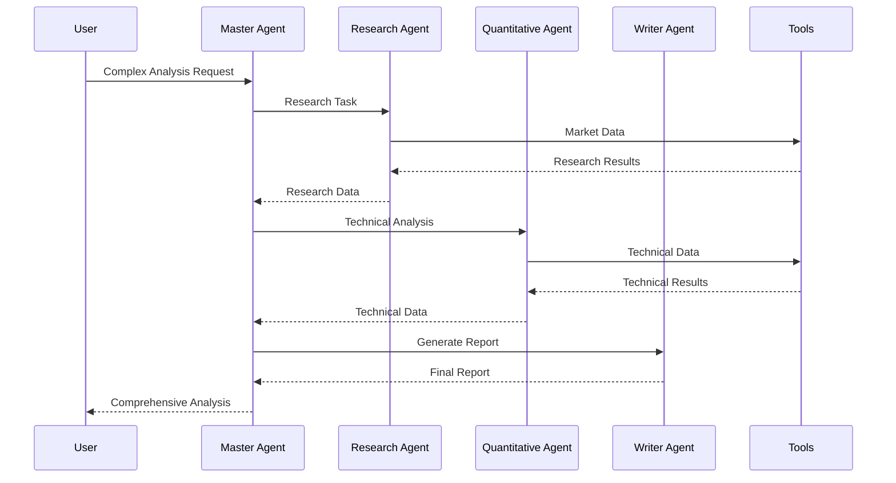
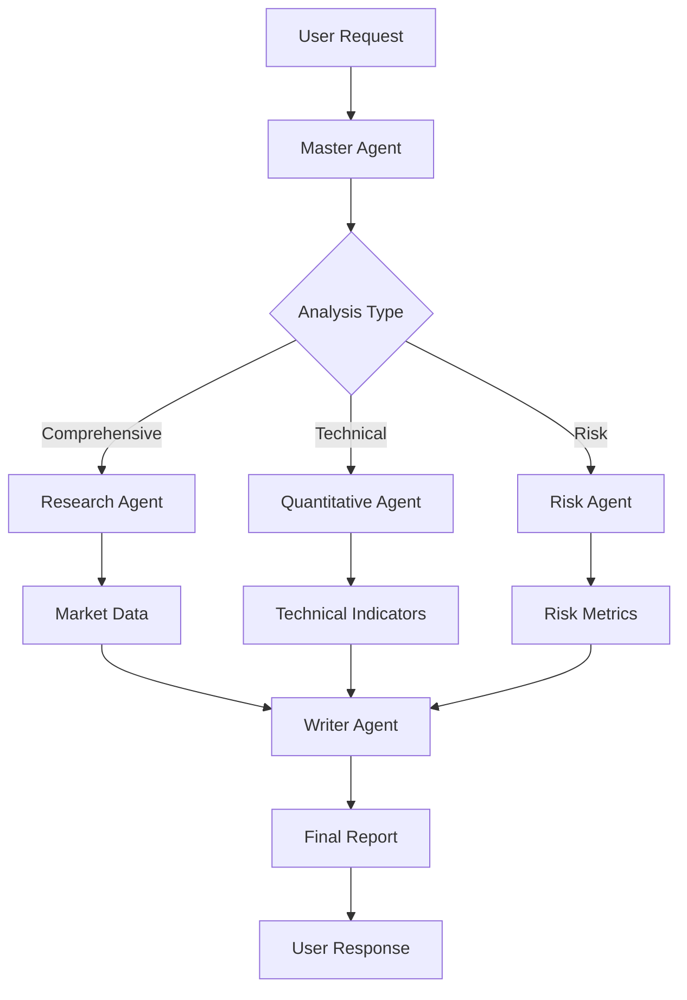

# Agents System Documentation

## 🤖 Overview

The FinanceBot system employs a sophisticated multi-agent architecture with specialized agents designed to handle different aspects of financial analysis. Each agent is optimized for specific tasks while maintaining the ability to collaborate and share context.

## 🎯 Agent Hierarchy



## 🧠 Master Agent

### Purpose
The Master Agent serves as the central orchestrator that analyzes user queries, selects the most appropriate specialist or task agent, and coordinates the execution workflow.

### Key Capabilities
- **Query Analysis**: Understands user intent and determines query type
- **Agent Selection**: Chooses the best agent based on confidence scoring
- **Workflow Orchestration**: Coordinates multi-step analysis processes
- **Response Synthesis**: Combines results from multiple agents
- **Context Management**: Maintains conversation context and user preferences

### Query Types Handled
- `STOCK_RESEARCH`: Comprehensive stock analysis
- `QUANTITATIVE_ANALYSIS`: Technical and quantitative metrics
- `FINANCIAL_DOCUMENT`: Document analysis and extraction
- `RISK_ASSESSMENT`: Risk evaluation and portfolio analysis
- `MARKET_SEARCH`: Real-time market data queries
- `CHART_GENERATION`: Visual chart creation
- `REPORT_WRITING`: Professional report generation
- `COMPREHENSIVE_ANALYSIS`: Multi-faceted analysis
- `GENERAL_FINANCE`: General financial queries

### Decision Logic



## 🔬 Specialist Agents

### 1. Research Agent (`research_agent`)

**Purpose**: Comprehensive stock research and fundamental analysis

**Capabilities**:
- Fundamental analysis (P/E, P/B, ROE, ROA ratios)
- Market sentiment analysis
- Industry comparison
- Competitive positioning
- Growth prospects evaluation
- Investment thesis development

**Tools Used**:
- `get_realtime_market_data`: Current market data
- `get_stock_with_technical_analysis`: Historical data with indicators
- `get_crypto_market_data`: Cryptocurrency data
- `retrieval_tool`: Information search

**Output Schema**: `ResearchAnalysis`
```python
class ResearchAnalysis(BaseModel):
    symbol: str
    company_name: str
    current_price: float
    market_cap: float
    analysis_type: AnalysisType
    fundamental_metrics: Dict[str, Any]
    technical_indicators: Dict[str, Any]
    market_sentiment: Dict[str, Any]
    investment_recommendation: str
    risk_factors: List[str]
    key_insights: List[str]
    confidence_score: float
```

### 2. Quantitative Agent (`quant_agent`)

**Purpose**: Technical analysis and quantitative metrics calculation

**Capabilities**:
- Technical indicator calculation (RSI, MACD, Bollinger Bands)
- Moving average analysis
- Volume analysis
- Momentum indicators
- Volatility measurements
- Statistical analysis

**Tools Used**:
- `get_stock_with_technical_analysis`: Data with pre-calculated indicators
- `get_realtime_market_data`: Current market data
- `get_crypto_market_data`: Crypto market data

**Output Schema**: `QuantitativeAnalysis`
```python
class QuantitativeAnalysis(BaseModel):
    symbol: str
    analysis_type: AnalysisType
    timeframe: str
    metrics: Optional[Dict[str, Any]] = Field(default_factory=dict)
    indicators: Optional[Dict[str, Any]] = Field(default_factory=dict)
    signals: Optional[List[str]] = Field(default_factory=list)
    risk_metrics: Optional[Dict[str, Any]] = Field(default_factory=dict)
    valuation: Optional[Dict[str, Any]] = Field(default_factory=dict)
    recommendations: Optional[List[str]] = Field(default_factory=list)
    confidence_score: Optional[float] = Field(default=0.0)
```

**Analysis Types**:
- `TECHNICAL`: Technical analysis focus
- `FUNDAMENTAL`: Fundamental metrics
- `QUANTITATIVE`: Quantitative analysis
- `PORTFOLIO`: Portfolio-level analysis

### 3. Risk Agent (`risk_agent`)

**Purpose**: Risk assessment and portfolio risk analysis

**Capabilities**:
- Individual asset risk evaluation
- Portfolio risk assessment
- Risk factor identification
- Risk mitigation strategies
- Volatility analysis
- Correlation analysis

**Tools Used**:
- `get_realtime_market_data`: Market data for risk calculation
- `get_stock_with_technical_analysis`: Historical data for volatility
- Portfolio analysis tools

**Output Schema**: `AnalysisSummary`
```python
class AnalysisSummary(BaseModel):
    symbol: str
    risk_level: str
    risk_score: float
    volatility_metrics: Dict[str, Any]
    correlation_analysis: Dict[str, Any]
    risk_factors: List[str]
    mitigation_strategies: List[str]
    recommendations: List[str]
```

### 4. Financial Document Agent (`fin_doc_agent`)

**Purpose**: Analysis of financial documents and reports

**Capabilities**:
- Financial statement analysis
- Document data extraction
- Key ratio calculation
- Trend analysis
- Comparative analysis
- Insight generation

**Tools Used**:
- `retrieval_tool`: Document search and analysis
- Financial calculation tools

**Output Schema**: `FinancialAnalysis`
```python
class FinancialAnalysis(BaseModel):
    document_type: str
    company: str
    period: str
    key_ratios: Optional[Dict[str, Any]] = Field(default_factory=dict)
    trends: Optional[Dict[str, Any]] = Field(default_factory=dict)
    insights: Optional[List[str]] = Field(default_factory=list)
    recommendations: Optional[List[str]] = Field(default_factory=list)
    risk_factors: Optional[List[str]] = Field(default_factory=list)
```

## 🛠️ Task Agents

### 1. Search Agent (`search_agent`)

**Purpose**: Information retrieval and market data search

**Capabilities**:
- Multi-source information search
- Market data aggregation
- News sentiment analysis
- Real-time data fetching
- Historical data retrieval

**Output Schema**: `SearchResult`
```python
class SearchResult(BaseModel):
    query: str
    results: List[Dict[str, Any]]
    sources: List[str]
    confidence_score: float
    timestamp: datetime
```

### 2. Chart Generator Agent (`chart_generator_agent`)

**Purpose**: Professional financial chart generation and visualization

**Capabilities**:
- Multiple chart types (line, candlestick, bar, pie)
- Technical indicator overlays
- Custom styling and formatting
- PNG export functionality
- Interactive chart generation

**Chart Types**:
- `LINE_CHART`: Price line charts
- `CANDLESTICK`: OHLC candlestick charts
- `VOLUME`: Volume analysis charts
- `TECHNICAL_INDICATORS`: Technical indicator charts
- `COMPARISON`: Multi-asset comparison
- `SECTOR_COMPARISON`: Sector analysis charts

**Output Schema**: `GeneratedChart`
```python
class GeneratedChart(BaseModel):
    chart_type: ChartType
    title: str
    data: Dict[str, Any]
    chart_config: Dict[str, Any]
    file_path: Optional[str] = None
    description: str
    insights: List[str]
```

### 3. Writer Agent (`writer_agent`)

**Purpose**: Professional financial report generation

**Capabilities**:
- Comprehensive financial reports
- Investment recommendations
- Risk assessments
- Market context analysis
- Professional formatting
- Multi-section reports

**Output Schema**: `ProfessionalFinancialReport`
```python
class ProfessionalFinancialReport(BaseModel):
    title: str
    executive_summary: str
    investment_recommendation: InvestmentRecommendation
    risk_assessment: RiskAssessment
    market_context: MarketContext
    analysis_sections: Optional[List[FinancialAnalysisSection]] = Field(default_factory=list)
    key_metrics: Optional[Dict[str, Any]] = Field(default_factory=dict)
    charts_summary: Optional[List[str]] = Field(default_factory=list)
    follow_up_questions: Optional[List[str]] = Field(default_factory=list)
    data_sources: Optional[List[str]] = Field(default_factory=list)
```

## 🔧 Direct Tools

### Market Data Tools
- **`get_realtime_market_data`**: Real-time stock market data for Vietnamese and global markets
- **`get_crypto_market_data`**: Cryptocurrency market data and prices
- **`get_stock_with_technical_analysis`**: Combined market data with technical indicators

### Analysis Tools
- **`retrieval_tool`**: General information search and retrieval
- Technical analysis calculation tools
- Financial calculation utilities

## 🔄 Agent Workflows

### 1. Simple Query Workflow



### 2. Complex Analysis Workflow



### 3. Multi-Agent Collaboration



## 📊 Agent Performance Metrics

### Selection Accuracy
- **Confidence Scoring**: Each agent selection includes a confidence score (0-1)
- **Success Rate**: Track successful task completions per agent
- **User Satisfaction**: Measure response quality and relevance

### Execution Performance
- **Response Time**: Track execution time for each agent
- **Tool Usage**: Monitor tool call frequency and success rates
- **Error Handling**: Track and analyze agent failures

### Collaboration Effectiveness
- **Multi-Agent Workflows**: Measure success of complex analyses
- **Context Sharing**: Track information flow between agents
- **Result Synthesis**: Evaluate quality of combined outputs

## 🎯 Best Practices

### Agent Design
1. **Single Responsibility**: Each agent should have a clear, focused purpose
2. **Tool Integration**: Agents should leverage appropriate tools effectively
3. **Error Handling**: Robust error handling and fallback mechanisms
4. **Output Consistency**: Standardized output schemas across agents

### Workflow Optimization
1. **Agent Selection**: Use confidence scoring for optimal agent selection
2. **Parallel Execution**: Execute independent tasks in parallel when possible
3. **Context Preservation**: Maintain context across agent interactions
4. **Result Caching**: Cache results for frequently requested analyses

### Monitoring and Maintenance
1. **Performance Tracking**: Monitor agent performance metrics
2. **Continuous Improvement**: Regular updates based on usage patterns
3. **Tool Updates**: Keep tools and data sources current
4. **User Feedback**: Incorporate user feedback for agent improvements

This agent system provides a flexible, scalable foundation for handling diverse financial analysis requirements while maintaining high performance and accuracy.
