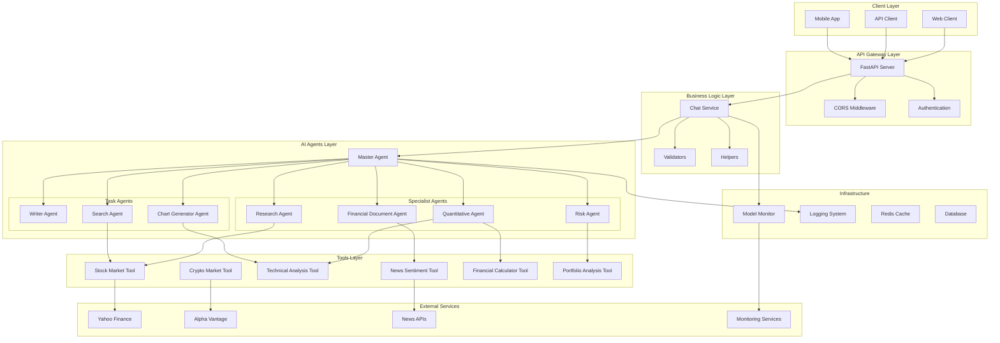
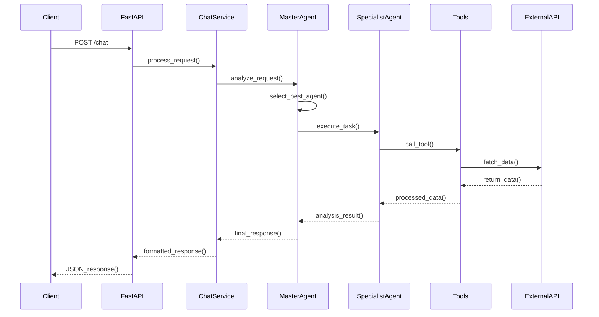
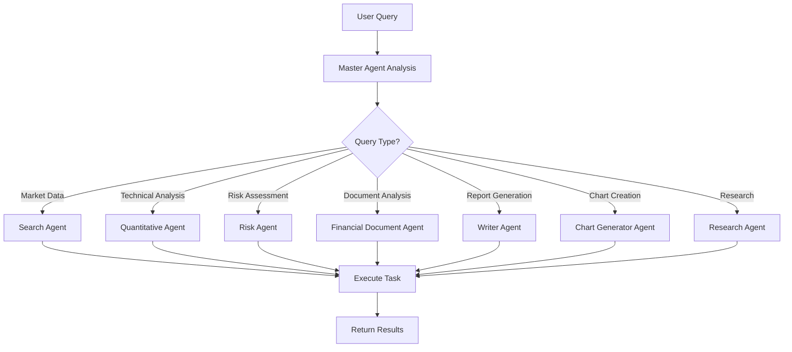

# FinanceBot Architecture Overview

## 🏗️ System Architecture

FinanceBot is built as a modular, scalable AI-powered financial analysis platform with a clean separation of concerns and modern architectural patterns.

### High-Level Architecture

## 🧩 Core Components

### 1. FastAPI Service Layer
- **Purpose**: RESTful API gateway and request handling
- **Key Features**:
  - Async request processing
  - Automatic API documentation
  - CORS support
  - Request validation
  - Error handling

### 2. Business Logic Layer
- **Chat Service**: Core business logic for handling user interactions
- **Validators**: Input validation and sanitization
- **Helpers**: Utility functions and common operations

### 3. AI Agents System
- **Master Agent**: Central orchestrator that routes requests to appropriate agents
- **Specialist Agents**: Domain-specific AI agents for different types of analysis
- **Task Agents**: Agents that perform specific tasks like report generation

### 4. Tools Layer
- **Market Data Tools**: Real-time and historical market data retrieval
- **Analysis Tools**: Technical analysis, financial calculations
- **News Tools**: News sentiment analysis and market sentiment

### 5. Monitoring & Observability
- **Model Monitor**: Unified monitoring system supporting multiple providers
- **Logging**: Comprehensive logging across all components
- **Tracing**: Request tracing and performance monitoring

## 🔄 Data Flow

### 1. Request Processing Flow

### 2. Agent Selection Process

## 🏛️ Design Patterns

### 1. Agent Pattern
- Each agent is a specialized AI component with specific capabilities
- Agents can collaborate and chain operations
- Clear separation of concerns between different types of analysis

### 2. Tool Pattern
- Tools are stateless functions that perform specific operations
- Tools can be shared across multiple agents
- Easy to test and maintain

### 3. Service Layer Pattern
- Business logic separated from API layer
- Easy to test and mock
- Clear interfaces between layers

### 4. Dependency Injection
- Services and dependencies are injected rather than hardcoded
- Easy to swap implementations
- Better testability

## 📊 Scalability Considerations

### Horizontal Scaling
- Stateless agents allow for easy horizontal scaling
- FastAPI supports async processing for high concurrency
- External service dependencies are abstracted

### Caching Strategy
- Redis for session management and caching
- Response caching for expensive operations
- Market data caching to reduce API calls

### Monitoring & Alerting
- Comprehensive logging and metrics
- Health checks and circuit breakers
- Performance monitoring and alerting

## 🔒 Security Architecture

### API Security
- Input validation and sanitization
- Rate limiting and throttling
- CORS configuration
- Authentication and authorization (planned)

### Data Security
- No sensitive data stored locally
- Secure API key management
- Encrypted communication with external services

### Agent Security
- Tool execution sandboxing
- Input validation for all tools
- Error handling to prevent information leakage

## 🚀 Performance Optimizations

### Async Processing
- Non-blocking I/O operations
- Concurrent request handling
- Async agent execution

### Caching
- Response caching for repeated queries
- Market data caching
- Agent result caching

### Resource Management
- Connection pooling for external APIs
- Memory-efficient data processing
- Garbage collection optimization

This architecture provides a solid foundation for a scalable, maintainable, and extensible financial analysis platform.
