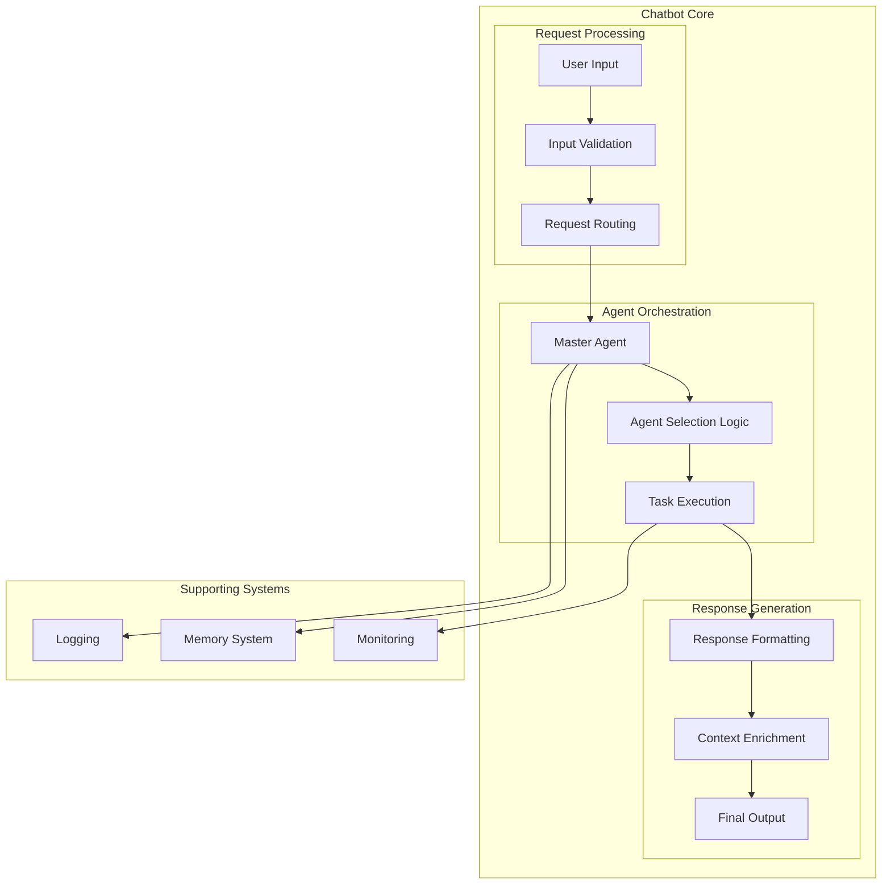
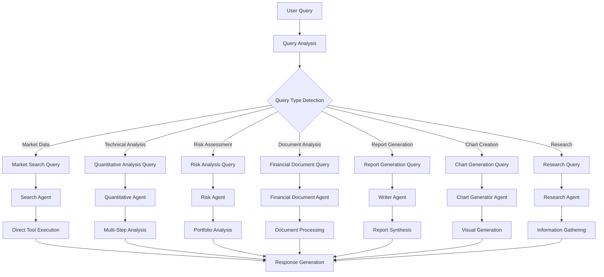
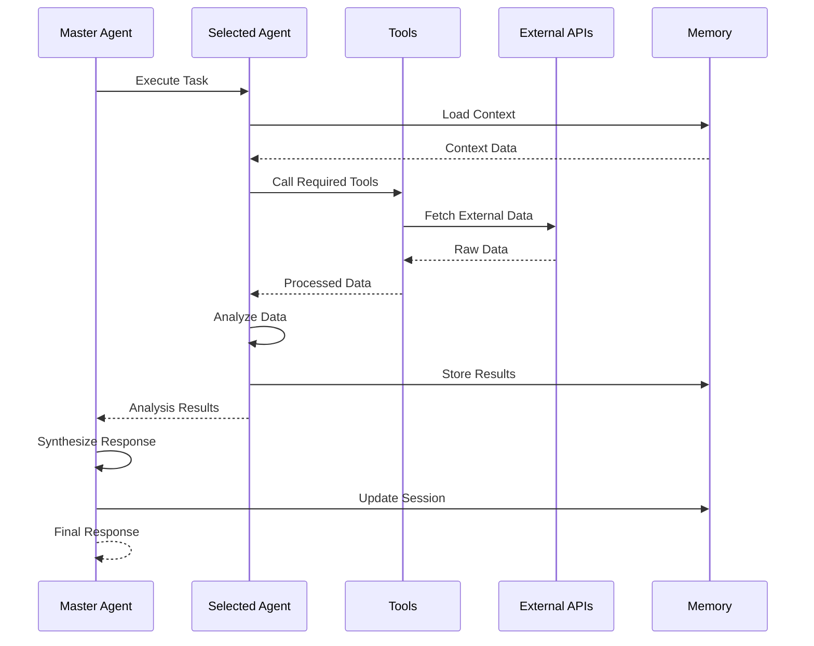

# Chatbot Core Architecture

## 🧠 Core Components Overview

The FinanceBot chatbot core is built around a sophisticated multi-agent system that orchestrates different specialized AI agents to provide comprehensive financial analysis and insights.

### Core Architecture Components



## 🎯 Master Agent: The Central Orchestrator

The Master Agent is the heart of the chatbot system, responsible for understanding user intent and coordinating the appropriate specialized agents.

### Key Responsibilities

1. **Intent Recognition**: Analyze user queries to determine the type of financial analysis needed
2. **Agent Selection**: Choose the most appropriate specialist or task agent
3. **Task Orchestration**: Coordinate multi-step analysis workflows
4. **Context Management**: Maintain conversation context and user preferences
5. **Response Synthesis**: Combine results from multiple agents into coherent responses

### Master Agent Decision Tree



## 🔄 Request Processing Pipeline

### 1. Input Processing

```python
# Simplified request processing flow
class ChatService:
    async def chat(self, request: ChatRequest) -> ChatResponse:
        # 1. Validate input
        validated_input = self.validate_input(request.message)
        
        # 2. Generate unique request ID
        request_id = self.generate_request_id()
        
        # 3. Process with Master Agent
        result = await self.master_agent.process_request(
            query=validated_input,
            request_id=request_id
        )
        
        # 4. Format response
        return self.format_response(result)
```

### 2. Agent Selection Logic

The Master Agent uses a sophisticated selection algorithm:

```python
def select_agent(self, query: str, query_type: QueryType) -> AgentSelection:
    """
    Select the most appropriate agent based on query analysis
    """
    confidence_scores = {}
    
    # Calculate confidence scores for each agent
    for agent in self.available_agents:
        confidence_scores[agent.name] = self.calculate_confidence(
            query, query_type, agent.capabilities
        )
    
    # Select agent with highest confidence
    selected_agent = max(confidence_scores.items(), key=lambda x: x[1])
    
    return AgentSelection(
        agent_name=selected_agent[0],
        confidence_score=selected_agent[1],
        reasoning=self.generate_reasoning(query, selected_agent[0])
    )
```

### 3. Task Execution Flow



## 🧩 Agent Communication Patterns

### 1. Direct Tool Execution
For simple queries that require single tool execution:

```python
# Example: Market data request
if query_type == QueryType.MARKET_SEARCH:
    tool_result = await self.execute_tool_directly(
        tool_name="get_realtime_market_data",
        parameters={"symbol": symbol}
    )
    return self.format_market_response(tool_result)
```

### 2. Multi-Agent Collaboration
For complex analysis requiring multiple agents:

```python
# Example: Comprehensive stock analysis
async def comprehensive_analysis(self, symbol: str):
    # Step 1: Get market data
    market_data = await self.search_agent.get_market_data(symbol)
    
    # Step 2: Technical analysis
    technical_analysis = await self.quant_agent.analyze_technical(symbol)
    
    # Step 3: Risk assessment
    risk_analysis = await self.risk_agent.assess_risk(symbol)
    
    # Step 4: Generate report
    report = await self.writer_agent.generate_report(
        market_data, technical_analysis, risk_analysis
    )
    
    return report
```

### 3. Context-Aware Processing
Agents maintain and share context across interactions:

```python
class AgentContext:
    def __init__(self):
        self.session_data = {}
        self.user_preferences = {}
        self.previous_queries = []
        self.analysis_history = {}
    
    def update_context(self, agent_name: str, result: Any):
        """Update context with agent results"""
        self.analysis_history[agent_name] = result
        self.session_data.update(result.get('context', {}))
```

## 🎨 Response Generation System

### 1. Response Formatting

The system supports multiple response formats:

```python
class ResponseFormatter:
    def format_response(self, result: AgentResult) -> Dict[str, Any]:
        """Format agent result into structured response"""
        return {
            "success": True,
            "message_id": result.request_id,
            "response": self.serialize_response(result.final_output),
            "selected_agent": {
                "name": result.selected_agent.name,
                "type": result.selected_agent.agent_type,
                "confidence": result.selected_agent.confidence_score
            },
            "execution_time": result.execution_time,
            "timestamp": result.timestamp,
            "follow_up_suggestions": result.follow_up_suggestions
        }
```

### 2. Context Enrichment

Responses are enriched with additional context:

```python
def enrich_response(self, base_response: Dict, context: AgentContext) -> Dict:
    """Add contextual information to response"""
    enriched = base_response.copy()
    
    # Add relevant follow-up suggestions
    enriched["follow_up_suggestions"] = self.generate_suggestions(
        context.previous_queries,
        context.user_preferences
    )
    
    # Add session information
    enriched["session_id"] = context.session_id
    
    return enriched
```

## 🧠 Memory and Context Management

### 1. Session Memory
- **User Preferences**: Store user's preferred analysis types, timeframes, and formats
- **Query History**: Maintain conversation history for context
- **Analysis Results**: Cache recent analysis results for quick access

### 2. Knowledge Base
- **Market Data Cache**: Store frequently accessed market data
- **Analysis Templates**: Pre-defined analysis templates for common queries
- **User Patterns**: Learn from user behavior to improve recommendations

### 3. Context Persistence

```python
class MemoryManager:
    def __init__(self):
        self.session_store = {}
        self.knowledge_base = {}
    
    async def get_context(self, session_id: str) -> AgentContext:
        """Retrieve context for session"""
        return self.session_store.get(session_id, AgentContext())
    
    async def save_context(self, session_id: str, context: AgentContext):
        """Save context for session"""
        self.session_store[session_id] = context
```

## 🔍 Error Handling and Recovery

### 1. Agent Failure Handling

```python
async def execute_with_fallback(self, primary_agent: str, fallback_agents: List[str]):
    """Execute with fallback agents if primary fails"""
    try:
        return await self.execute_agent(primary_agent)
    except AgentError as e:
        logger.warning(f"Primary agent failed: {e}")
        
        for fallback in fallback_agents:
            try:
                return await self.execute_agent(fallback)
            except AgentError:
                continue
        
        raise AllAgentsFailedError("All agents failed to execute")
```

### 2. Tool Failure Recovery

```python
async def execute_tool_with_retry(self, tool_name: str, parameters: Dict, max_retries: int = 3):
    """Execute tool with exponential backoff retry"""
    for attempt in range(max_retries):
        try:
            return await self.call_tool(tool_name, parameters)
        except ToolError as e:
            if attempt == max_retries - 1:
                raise
            await asyncio.sleep(2 ** attempt)  # Exponential backoff
```

## 📊 Performance Monitoring

### 1. Response Time Tracking
- Track execution time for each agent
- Monitor tool call performance
- Identify bottlenecks in the pipeline

### 2. Success Rate Monitoring
- Monitor agent selection accuracy
- Track tool execution success rates
- Measure user satisfaction metrics

### 3. Resource Usage
- Memory usage tracking
- API call frequency monitoring
- Cost optimization metrics

This core architecture provides a robust foundation for handling complex financial analysis requests while maintaining high performance and reliability.
