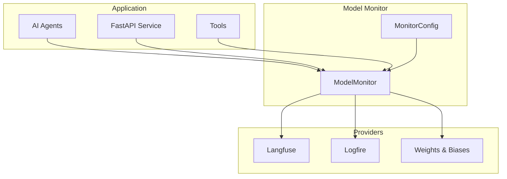

# Monitoring & Observability

## 📊 Overview

FinanceBot includes comprehensive monitoring and observability features through multiple providers including Langfuse, Logfire, and Weights & Biases. This unified monitoring system tracks agent performance, API usage, and system health.

## 🔧 Model Monitor System

### Architecture

The Model Monitor system provides a unified interface for multiple monitoring providers:



### Configuration

#### Environment Variables

```bash
# Langfuse Configuration
LANGFUSE_PUBLIC_KEY=pk-lf-your-public-key
LANGFUSE_SECRET_KEY=sk-lf-your-secret-key
LANGFUSE_HOST=https://cloud.langfuse.com

# Logfire Configuration
LOGFIRE_TOKEN=your-logfire-token

# Weights & Biases Configuration
WANDB_API_KEY=your-wandb-api-key
WANDB_PROJECT=financebot
WANDB_ENTITY=your-entity
```

#### Monitor Setup

```python
from app.monitors import create_monitor

# Create monitor with all providers
monitor = create_monitor(
    langfuse_config={
        "public_key": "pk-lf-your-key",
        "secret_key": "sk-lf-your-key",
        "host": "https://cloud.langfuse.com"
    },
    logfire_config={
        "token": "your-logfire-token"
    },
    wandb_config={
        "api_key": "your-wandb-key",
        "project": "financebot",
        "entity": "your-entity"
    }
)

# Initialize monitoring
await monitor.initialize()

# Use in application
async def process_request(request):
    with monitor.trace("chat_request") as span:
        result = await agent.process(request)
        span.set_attribute("success", True)
        span.set_attribute("execution_time", result.execution_time)
        return result
```

## 🔍 Langfuse Integration

### Features

- **Request Tracing**: Track complete request flows through agents
- **Agent Performance**: Monitor individual agent execution times and success rates
- **Token Usage**: Track OpenAI API token consumption
- **Error Tracking**: Capture and analyze agent errors
- **Custom Metrics**: Define custom metrics for business logic

### Implementation

```python
from langfuse import Langfuse
from langfuse.decorators import observe

class ChatService:
    def __init__(self):
        self.langfuse = Langfuse(
            public_key=os.getenv("LANGFUSE_PUBLIC_KEY"),
            secret_key=os.getenv("LANGFUSE_SECRET_KEY"),
            host=os.getenv("LANGFUSE_HOST", "https://cloud.langfuse.com")
        )
    
    @observe(name="chat_request")
    async def chat(self, message: str) -> Dict[str, Any]:
        """Process chat request with Langfuse tracing."""
        
        # Start trace
        trace = self.langfuse.trace(name="chat_request")
        
        try:
            # Process with master agent
            with trace.span(name="master_agent_selection") as span:
                selected_agent = await self.master_agent.select_agent(message)
                span.set_attribute("selected_agent", selected_agent.name)
                span.set_attribute("confidence_score", selected_agent.confidence_score)
            
            # Execute agent
            with trace.span(name="agent_execution") as span:
                result = await selected_agent.execute(message)
                span.set_attribute("execution_time", result.execution_time)
                span.set_attribute("success", result.success)
            
            # Capture output
            trace.update(output=result.final_output)
            
            return result
            
        except Exception as e:
            trace.update(error=str(e))
            raise
        finally:
            # Flush traces
            self.langfuse.flush()
```

### Custom Metrics

```python
# Track custom business metrics
def track_agent_performance(agent_name: str, execution_time: float, success: bool):
    """Track agent performance metrics."""
    
    langfuse = Langfuse()
    
    # Create custom metric
    langfuse.score(
        name="agent_performance",
        value=execution_time,
        comment=f"Agent: {agent_name}, Success: {success}"
    )
    
    # Track success rate
    langfuse.score(
        name="agent_success_rate",
        value=1 if success else 0,
        comment=f"Agent: {agent_name}"
    )

# Usage in agents
class ResearchAgent:
    async def execute(self, query: str):
        start_time = time.time()
        
        try:
            result = await self.analyze_stock(query)
            execution_time = time.time() - start_time
            
            # Track metrics
            track_agent_performance("research_agent", execution_time, True)
            
            return result
            
        except Exception as e:
            execution_time = time.time() - start_time
            track_agent_performance("research_agent", execution_time, False)
            raise
```

## 🔥 Logfire Integration

### Features

- **Structured Logging**: JSON-structured logs with context
- **Distributed Tracing**: Track requests across services
- **Performance Monitoring**: Monitor application performance
- **Error Tracking**: Detailed error logging and analysis

### Implementation

```python
import logfire

# Configure Logfire
logfire.configure(
    token=os.getenv("LOGFIRE_TOKEN"),
    service_name="financebot",
    service_version="1.0.0"
)

class ChatService:
    @logfire.instrument()
    async def chat(self, message: str) -> Dict[str, Any]:
        """Process chat with Logfire instrumentation."""
        
        # Structured logging
        logfire.info(
            "Processing chat request",
            message=message,
            user_id=self.user_id,
            session_id=self.session_id
        )
        
        try:
            # Process request
            result = await self.master_agent.process(message)
            
            # Log success
            logfire.info(
                "Chat request completed",
                execution_time=result.execution_time,
                agent_used=result.selected_agent.name,
                confidence_score=result.selected_agent.confidence_score
            )
            
            return result
            
        except Exception as e:
            # Log error with context
            logfire.error(
                "Chat request failed",
                error=str(e),
                error_type=type(e).__name__,
                message=message,
                exc_info=True
            )
            raise
```

### Custom Metrics

```python
import logfire

# Track custom metrics
@logfire.metric("agent_execution_time")
def track_execution_time(agent_name: str, execution_time: float):
    """Track agent execution time."""
    logfire.info(
        "Agent execution time",
        agent_name=agent_name,
        execution_time=execution_time,
        metric_type="performance"
    )

# Track business metrics
@logfire.metric("user_engagement")
def track_user_engagement(user_id: str, action: str):
    """Track user engagement metrics."""
    logfire.info(
        "User engagement",
        user_id=user_id,
        action=action,
        timestamp=datetime.utcnow().isoformat(),
        metric_type="engagement"
    )
```

## 📈 Weights & Biases Integration

### Features

- **Experiment Tracking**: Track model experiments and hyperparameters
- **Model Performance**: Monitor model accuracy and performance
- **Data Visualization**: Create charts and dashboards
- **Collaboration**: Share experiments with team members

### Implementation

```python
import wandb

class AgentExperiment:
    def __init__(self, agent_name: str):
        self.agent_name = agent_name
        wandb.init(
            project="financebot",
            entity=os.getenv("WANDB_ENTITY"),
            name=f"{agent_name}_experiment",
            config={
                "agent_name": agent_name,
                "model": "gpt-4",
                "temperature": 0.7
            }
        )
    
    def log_performance(self, metrics: Dict[str, float]):
        """Log agent performance metrics."""
        wandb.log({
            "accuracy": metrics.get("accuracy", 0),
            "execution_time": metrics.get("execution_time", 0),
            "confidence_score": metrics.get("confidence_score", 0),
            "success_rate": metrics.get("success_rate", 0)
        })
    
    def log_prediction(self, input_data: str, prediction: str, actual: str = None):
        """Log individual predictions."""
        wandb.log({
            "input_length": len(input_data),
            "prediction_length": len(prediction),
            "prediction": prediction,
            "actual": actual
        })
    
    def finish(self):
        """Finish the experiment."""
        wandb.finish()

# Usage in agents
class QuantitativeAgent:
    async def execute(self, query: str):
        experiment = AgentExperiment("quantitative_agent")
        
        try:
            result = await self.analyze(query)
            
            # Log performance
            experiment.log_performance({
                "accuracy": result.confidence_score,
                "execution_time": result.execution_time,
                "confidence_score": result.confidence_score
            })
            
            return result
            
        finally:
            experiment.finish()
```

## 📊 Health Monitoring

### Health Check Endpoint

```python
from fastapi import FastAPI
from datetime import datetime

@app.get("/health")
async def health_check():
    """Comprehensive health check endpoint."""
    
    health_status = {
        "status": "healthy",
        "timestamp": datetime.utcnow().isoformat(),
        "version": "1.0.0",
        "checks": {}
    }
    
    # Check OpenAI API
    try:
        # Test OpenAI connection
        health_status["checks"]["openai"] = {
            "status": "healthy",
            "response_time": "< 1s"
        }
    except Exception as e:
        health_status["checks"]["openai"] = {
            "status": "unhealthy",
            "error": str(e)
        }
        health_status["status"] = "degraded"
    
    # Check monitoring services
    try:
        # Test Langfuse connection
        health_status["checks"]["langfuse"] = {
            "status": "healthy" if self.langfuse else "disabled"
        }
    except Exception as e:
        health_status["checks"]["langfuse"] = {
            "status": "unhealthy",
            "error": str(e)
        }
    
    # Check system resources
    import psutil
    health_status["checks"]["system"] = {
        "cpu_percent": psutil.cpu_percent(),
        "memory_percent": psutil.virtual_memory().percent,
        "disk_percent": psutil.disk_usage('/').percent
    }
    
    return health_status
```

### Custom Health Checks

```python
from fastapi import Depends

class HealthChecker:
    def __init__(self):
        self.checks = {}
    
    def register_check(self, name: str, check_func: callable):
        """Register a custom health check."""
        self.checks[name] = check_func
    
    async def run_checks(self) -> Dict[str, Any]:
        """Run all registered health checks."""
        results = {}
        
        for name, check_func in self.checks.items():
            try:
                result = await check_func()
                results[name] = {
                    "status": "healthy",
                    "details": result
                }
            except Exception as e:
                results[name] = {
                    "status": "unhealthy",
                    "error": str(e)
                }
        
        return results

# Usage
health_checker = HealthChecker()

@health_checker.register_check("database")
async def check_database():
    """Check database connectivity."""
    # Implementation
    return {"connected": True, "response_time": "10ms"}

@health_checker.register_check("redis")
async def check_redis():
    """Check Redis connectivity."""
    # Implementation
    return {"connected": True, "memory_usage": "50MB"}
```

## 🚨 Alerting and Notifications

### Error Alerting

```python
import smtplib
from email.mime.text import MIMEText
from email.mime.multipart import MIMEMultipart

class AlertManager:
    def __init__(self):
        self.smtp_server = os.getenv("SMTP_SERVER")
        self.smtp_port = int(os.getenv("SMTP_PORT", 587))
        self.email = os.getenv("ALERT_EMAIL")
        self.password = os.getenv("ALERT_EMAIL_PASSWORD")
    
    async def send_alert(self, alert_type: str, message: str, severity: str = "warning"):
        """Send alert notification."""
        
        if severity == "critical":
            # Send immediate notification
            await self._send_email(alert_type, message, severity)
            await self._send_slack_notification(alert_type, message, severity)
        elif severity == "warning":
            # Send to monitoring dashboard
            await self._log_to_monitoring(alert_type, message, severity)
    
    async def _send_email(self, alert_type: str, message: str, severity: str):
        """Send email alert."""
        msg = MIMEMultipart()
        msg['From'] = self.email
        msg['To'] = self.email
        msg['Subject'] = f"[{severity.upper()}] FinanceBot Alert: {alert_type}"
        
        body = f"""
        Alert Type: {alert_type}
        Severity: {severity}
        Message: {message}
        Timestamp: {datetime.utcnow().isoformat()}
        """
        
        msg.attach(MIMEText(body, 'plain'))
        
        server = smtplib.SMTP(self.smtp_server, self.smtp_port)
        server.starttls()
        server.login(self.email, self.password)
        server.send_message(msg)
        server.quit()
    
    async def _send_slack_notification(self, alert_type: str, message: str, severity: str):
        """Send Slack notification."""
        webhook_url = os.getenv("SLACK_WEBHOOK_URL")
        
        payload = {
            "text": f"🚨 FinanceBot Alert: {alert_type}",
            "attachments": [
                {
                    "color": "danger" if severity == "critical" else "warning",
                    "fields": [
                        {"title": "Alert Type", "value": alert_type, "short": True},
                        {"title": "Severity", "value": severity, "short": True},
                        {"title": "Message", "value": message, "short": False},
                        {"title": "Timestamp", "value": datetime.utcnow().isoformat(), "short": True}
                    ]
                }
            ]
        }
        
        import requests
        requests.post(webhook_url, json=payload)

# Usage
alert_manager = AlertManager()

# In error handling
try:
    result = await agent.execute(query)
except Exception as e:
    await alert_manager.send_alert(
        alert_type="agent_execution_error",
        message=f"Agent {agent.name} failed: {str(e)}",
        severity="critical"
    )
    raise
```

## 📈 Performance Metrics

### Key Performance Indicators (KPIs)

```python
class PerformanceTracker:
    def __init__(self):
        self.metrics = {
            "request_count": 0,
            "success_count": 0,
            "error_count": 0,
            "total_execution_time": 0,
            "agent_performance": {}
        }
    
    def track_request(self, agent_name: str, execution_time: float, success: bool):
        """Track request performance."""
        self.metrics["request_count"] += 1
        self.metrics["total_execution_time"] += execution_time
        
        if success:
            self.metrics["success_count"] += 1
        else:
            self.metrics["error_count"] += 1
        
        # Track per-agent metrics
        if agent_name not in self.metrics["agent_performance"]:
            self.metrics["agent_performance"][agent_name] = {
                "request_count": 0,
                "success_count": 0,
                "total_execution_time": 0
            }
        
        agent_metrics = self.metrics["agent_performance"][agent_name]
        agent_metrics["request_count"] += 1
        agent_metrics["total_execution_time"] += execution_time
        
        if success:
            agent_metrics["success_count"] += 1
    
    def get_summary(self) -> Dict[str, Any]:
        """Get performance summary."""
        total_requests = self.metrics["request_count"]
        
        return {
            "total_requests": total_requests,
            "success_rate": self.metrics["success_count"] / max(total_requests, 1),
            "average_execution_time": self.metrics["total_execution_time"] / max(total_requests, 1),
            "error_rate": self.metrics["error_count"] / max(total_requests, 1),
            "agent_performance": {
                agent: {
                    "request_count": metrics["request_count"],
                    "success_rate": metrics["success_count"] / max(metrics["request_count"], 1),
                    "average_execution_time": metrics["total_execution_time"] / max(metrics["request_count"], 1)
                }
                for agent, metrics in self.metrics["agent_performance"].items()
            }
        }
```

### Real-time Dashboards

```python
from fastapi import FastAPI
from fastapi.responses import HTMLResponse

@app.get("/metrics", response_class=HTMLResponse)
async def metrics_dashboard():
    """Real-time metrics dashboard."""
    
    performance = performance_tracker.get_summary()
    
    html = f"""
    <!DOCTYPE html>
    <html>
    <head>
        <title>FinanceBot Metrics</title>
        <script src="https://cdn.jsdelivr.net/npm/chart.js"></script>
        <style>
            body {{ font-family: Arial, sans-serif; margin: 20px; }}
            .metric {{ margin: 20px 0; padding: 20px; border: 1px solid #ddd; border-radius: 5px; }}
            .chart {{ width: 400px; height: 300px; }}
        </style>
    </head>
    <body>
        <h1>FinanceBot Performance Metrics</h1>
        
        <div class="metric">
            <h3>Overall Performance</h3>
            <p>Total Requests: {performance['total_requests']}</p>
            <p>Success Rate: {performance['success_rate']:.2%}</p>
            <p>Average Execution Time: {performance['average_execution_time']:.2f}s</p>
            <p>Error Rate: {performance['error_rate']:.2%}</p>
        </div>
        
        <div class="metric">
            <h3>Agent Performance</h3>
            <canvas id="agentChart" class="chart"></canvas>
        </div>
        
        <script>
            // Create agent performance chart
            const ctx = document.getElementById('agentChart').getContext('2d');
            const agentData = {json.dumps(performance['agent_performance'])};
            
            new Chart(ctx, {{
                type: 'bar',
                data: {{
                    labels: Object.keys(agentData),
                    datasets: [{{
                        label: 'Success Rate',
                        data: Object.values(agentData).map(a => a.success_rate * 100),
                        backgroundColor: 'rgba(75, 192, 192, 0.2)',
                        borderColor: 'rgba(75, 192, 192, 1)',
                        borderWidth: 1
                    }}]
                }},
                options: {{
                    scales: {{
                        y: {{
                            beginAtZero: true,
                            max: 100
                        }}
                    }}
                }}
            }});
        </script>
        
        <script>
            // Auto-refresh every 30 seconds
            setTimeout(() => location.reload(), 30000);
        </script>
    </body>
    </html>
    """
    
    return html
```

This comprehensive monitoring system provides visibility into all aspects of FinanceBot's performance, from individual agent execution to overall system health, ensuring reliable operation and continuous improvement.
